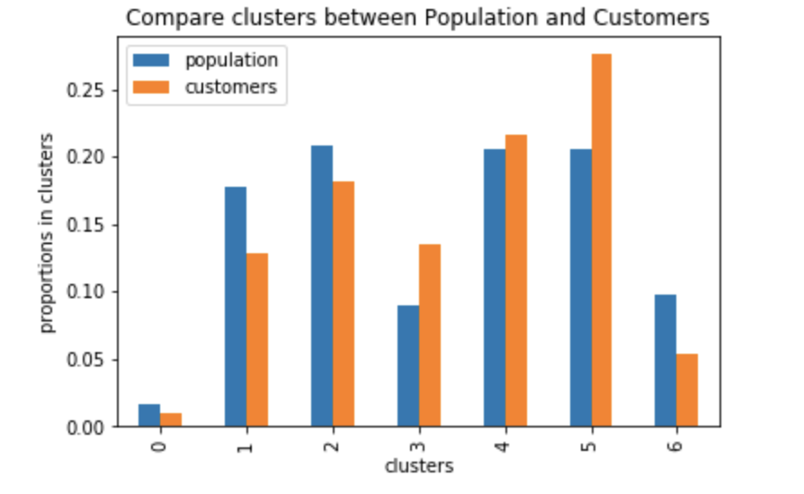

## Create a Customer Segmentation Report for Arvato Financial Services

### 1.Project Description

In this project, we  analyzed demographics data for customers of a mail-order sales company in Germany, comparing it against demographics information for the general population. We used unsupervised learning techniques to perform customer segmentation, identifying the parts of the population that best describe the core customer base of the company. Then, I applied what I had learned on a third dataset with demographics information for targets of a marketing campaign for the company, and used a model to predict which individuals are most likely to convert into becoming customers for the company. The data that  we used has been provided by  Bertelsmann Arvato Analytics on behalf of **Udacity**, and represents a real-life data science task.

### 2.Project Contents:

- Get to know the Data
- Customer Segmentation Report(Unspervised learning model)
- Supervised Learning Model
- Evaluation of Results

###  Get to know the Data
In this section we tried to get infomoration of the data as much as possible. we tried to analyse and visualize the data,then clean and scale it for modeling. 
This section is performed with following steps:

1. Analyse the Data
2. Clean 
3. Scale

#### Analyze Raw data:

There are four data files associated with this project:

Udacity_AZDIAS_052018.csv: Demographics data for the general population of Germany; 891 211 persons (rows) x 366 features (columns).
Udacity_CUSTOMERS_052018.csv: Demographics data for customers of a mail-order company; 191 652 persons (rows) x 369 features (columns).
Udacity_MAILOUT_052018_TRAIN.csv: Demographics data for individuals who were targets of a marketing campaign; 42 982 persons (rows) x 367 (columns).
Udacity_MAILOUT_052018_TEST.csv: Demographics data for individuals who were targets of a marketing campaign; 42 833 persons (rows) x 366 (columns).

Each row of the demographics files represents a single person, but also includes information outside of individuals, including information about their household, building, and neighborhood. Use the information from the first two files to figure out how customers ("CUSTOMERS") are similar to or differ from the general population at large ("AZDIAS"), then use your analysis to make predictions on the other two files ("MAILOUT"), predicting which recipients are most likely to become a customer for the mail-order company.

The "CUSTOMERS" file contains three extra columns ('CUSTOMER_GROUP', 'ONLINE_PURCHASE', and 'PRODUCT_GROUP'), which provide broad information about the customers depicted in the file. The original "MAILOUT" file included one additional column, "RESPONSE", which indicated whether or not each recipient became a customer of the company. For the "TRAIN" subset, this column has been retained, but in the "TEST" subset it has been removed; it is against that withheld column that your final predictions will be assessed in the Kaggle competition.

Otherwise, all of the remaining columns are the same between the three data files. For more information about the columns depicted in the files, you can refer to two Excel spreadsheets provided in the workspace. [One of them](./DIAS Information Levels - Attributes 2017.xlsx) is a top-level list of attributes and descriptions, organized by informational category. [The other](./DIAS Attributes - Values 2017.xlsx) is a detailed mapping of data values for each feature in alphabetical order.

You'll notice when the data is loaded in that a warning message will immediately pop up. Before you really start digging into the modeling and analysis, you're going to need to perform some cleaning. Take some time to browse the structure of the data and look over the informational spreadsheets to understand the data values. Make some decisions on which features to keep, which features to drop, and if any revisions need to be made on data formats. It'll be a good idea to create a function with pre-processing steps, since you'll need to clean all of the datasets before you work with them.

#### Clean Data:

The cleaning process consists of 5 main steps:

1. There are some values in the data which are labeled as uknown in the information excel file DIAS Attributes. These unkown values which take the values of 0,-1 and 9 in different columns need to be replaced by NaN values, as they don't contain any information and they are meaningless. So first step is to find these values and replace them with NaN.

2. There are two columns asscociated with date object(EINGEFUEGT_AM,GEBURTSJAHR). These columns should be treated as numbers. The second one is already number and for the first one we can convert it to year and the make it as float.
 
3. there are certain rows that are mostly NaN values and they give no useful information. in fact we can drop the people who contain a few information. So, we keep rows with at least 75% non NaN values.
 
4. we need to find the categorical columns and treat them well. we have to convert two of them to numerical columns, and decide which of them can be converted to dummies and which one is not necessary.
 
5. finally, we impute the NaN values with appropriate values of their assocciated columns.

#### Scale Data:

The scaling is necessary for this data and we used the sklearn **StandardScaler()** function to standardize it by subtracting the mean and dividing to standard deviation in each column. 

### Customer Segmentation Report(Unspervised learning model)

The main bulk of the analysis will come in this part of the project. Here, we  used unsupervised learning techniques to describe the relationship between the demographics of the company's existing customers and the general population of Germany. By the end of this part,we were able to describe parts of the general population that are more likely to be part of the mail-order company's main customer base, and which parts of the general population are less so.

the follosing steps are performed for this section:

- Principal Component Analysis of Population data
-  Clustering of the Data

as the number of features (365) are a lot for clustering of the data, we used PCA analysis to reduce the dimentionality of the azdias(population data) and then used **Kmean** clustering to find the cluster labels. we also used **elbow** method to find the optimal clusters of the data. then, we projected the customer data on the population clusters to find out which clusters they belong to. we plotted the total data cluster counts for each azdias and projected customers on azdias and the following plot illustrate the differences between them. 

### Supervised Learning Model

Now that we've found which parts of the population are more likely to be customers of the mail-order company, it's time to build a prediction model. Each of the rows in the "MAILOUT" data files represents an individual that was targeted for a mailout campaign. Ideally, we should be able to use the demographic information from each individual to decide whether or not it will be worth it to include that person in the campaign.

The "MAILOUT" data has been split into two approximately equal parts, each with almost 43 000 data rows. In this part, you can verify your model with the "TRAIN" partition, which includes a column, "RESPONSE", that states whether or not a person became a customer of the company following the campaign. In the next part, you'll need to create predictions on the "TEST" partition, where the "RESPONSE" column has been withheld.

After finding the difference between two data, we can use our information to build the supervised model. 

We have performed the supervised learning part using three different models using the **sklearn** libraries:

- RandomForestRegressor
- LogisticRegressionCV
- SVC(Support Vector Classifier) 

The cleaning process which is performed in the previous section is repeated for both of the train and test data here with one major difference. in the prevois section it was not important to lose some individuals with less information(many Nan values), but here we want to train and test for the whole individuals. So, we drop columns with many NaN values instead of rows. 

We also scale the data using functions provided in the previous section. 

### Evaluation of Results:

Now that we've created a model to predict which individuals are most likely to respond to a mailout campaign, it's time to test that model in competition through Kaggle. If you click on the link here, you'll be taken to the competition page where, if you have a Kaggle account, you can enter.

Your entry to the competition should be a CSV file with two columns. The first column should be a copy of "LNR", which acts as an ID number for each individual in the "TEST" partition. The second column, "RESPONSE", should be some measure of how likely each individual became a customer – this might not be a straightforward probability. As you should have found in Part 2, there is a large output class imbalance, where most individuals did not respond to the mailout. Thus, predicting individual classes and using accuracy does not seem to be an appropriate performance evaluation method. Instead, the competition will be using AUC to evaluate performance. The exact values of the "RESPONSE" column do not matter as much: only that the higher values try to capture as many of the actual customers as possible, early in the ROC curve sweep.

we use the test data to evaluate the performance of our models. 

The performance of the **RandomForestRegressor** has given us **AUC** score of **0.74554** by enetring to the competion in the **Kaggle website**. it is the best prediction we have been able toi create. the other two models LogisticRegression and SVC give 0.68 and ... which are much lower. The rank of our submission is 257 at the time of submission among 400 people participated in the project. 

We have used also the information from the Unsupervised Learning part such that we have used the **LogisticRegression** to find the best features or the highest informative  features to use them in this section. but, the evaluation results were not improved and it needs more detailed work to improve the results. 

### 3.Conclusion:

The model RandomForestregressor gives pretty good estimation for the test data. The prediction results for the three models created above are highlighted below. In svc model we used the top 100 features which represent the customer data to find better predictions. we fitted well with train data, but the prediction results were not improved and it was much worse than the other model predictions.

                             Train        Test

    RandomForestRegressor   0.975        0.745

    LogisticRegression      0.80         0.68

    SVC on top features     0.974        0.45

## 4.Acknowledgement:

Many Thanks to **Udacity** for providing me this opportunity to work on this project and all the support. I also thank Bertelsmann Arvato Analytics  for the real world data they have provided to make the project mouch interesting and challenging. The main data is hidden for privacy purposes so it is not provided for public. 

Other models in Machine Learning are needed to improve or compare with these results. Those models would be added in future and I welcome any contributors or helps from other data scientists.

